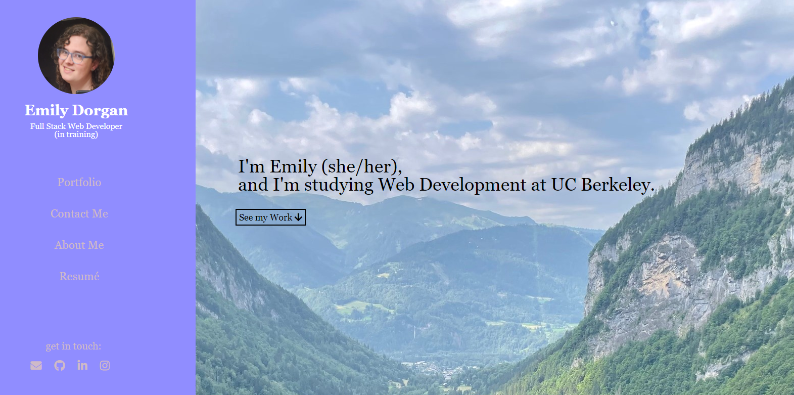
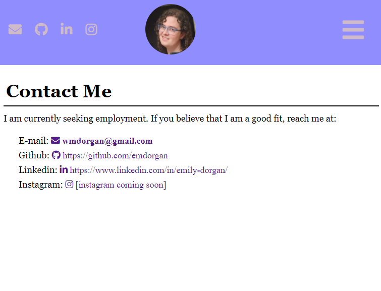
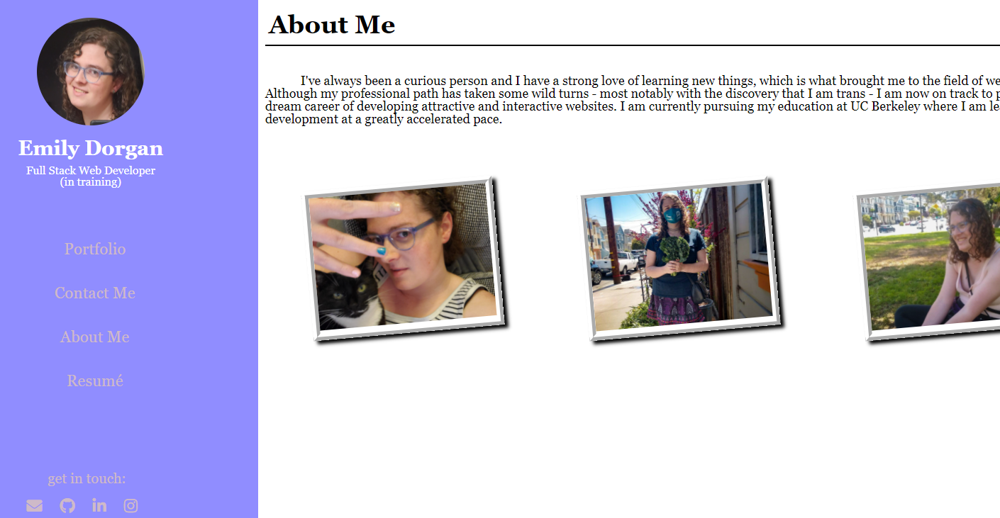
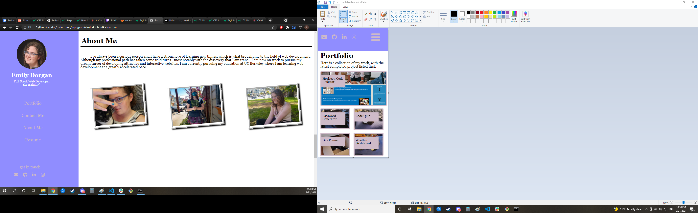
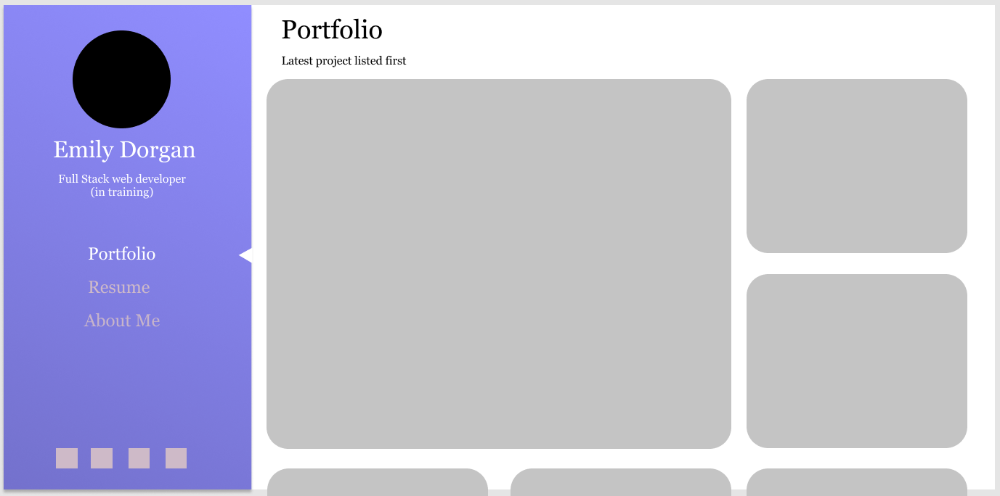
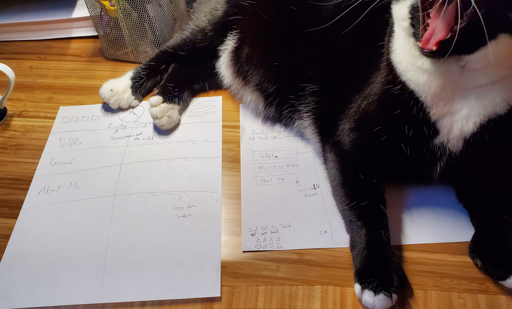

# Portfolio Project

The goal of this project is to put together a professional portfolio to showcase the work we'll be doing in this class. My approach was to create paper wireframes, then draw one on figma to organize my thoughts, taking inspiration from beautiful responsive web developer portfolios on the internet. Design-wise, I wanted a clean and professional portfolio that still remains aesthetically pleasing. The design color scheme was inspired by the pink/blue/white colors of the trans pride flag.

Since I see myself as a front-end web developer, I saw this as an opportunity to challenge myself and make something ambitious: A fixed sidebar that flips to the top of the screen on resize. This was by far the most challenging aspect, and took 70% of the time I allocated to this project.

# Known bugs

If you click on the links (or just open and close the mobile nav) in mobile mode and then resize the screen, those links remain hidden. I figured it would be a bad idea to have a constantly running JS script in the background just to check, and couldn't find the 'trigger' for a resizing of the window, so I left it as is for now.

# Potential improvements

* Fix the bug (mentioned above) where the nav items get hidden on browser resize.
* Figure out why the text-wrap changes abruptly on portfolio page.
* change padding or margin between nav items to be % based.
* spacing between non-featured projects could be improved to be more consistent.
* Make my name and title show up on the dropdown menu in small screen mode
* Change the id selector of the featured project to make it more flexible and easier to edit.
* Stop the nav bar from resizing vertically and stacking elements on top of each other.

# Screenshots

## Built With

* [HTML](https://developer.mozilla.org/en-US/docs/Web/HTML)
* [CSS](https://developer.mozilla.org/en-US/docs/Web/CSS)
* [JavaScript](https://developer.mozilla.org/en-US/docs/Web/JavaScript)
* [Figma](https://www.figma.com)

## Deployed Link

* [Link to Portfolio Site](https://emdorgan.github.io/portfolio/)

## Authors

* **Emily Dorgan** 

- [Link to Github](https://github.com/emdorgan)
- [Link to LinkedIn](https://www.linkedin.com/in/emily-dorgan/)

## Acknowledgments

* [W3Schools Mobile nav bar Tutorial](https://www.w3schools.com/howto/tryit.asp?filename=tryhow_js_mobile_navbar)
* [Font Awesome for the icons](https://fontawesome.com/)